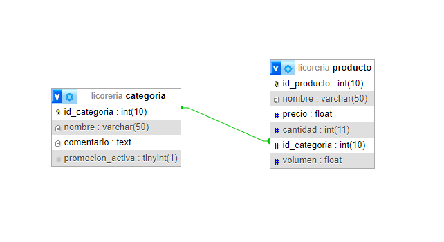

# Licoreria

La idea del proyecto es tener una negocio de bebidas alcoholicas en la web,donde se gestionan diferentes pedidos y distintos tipos de bebidas

## Descripción

En principio en nuestro proyecto tenemos dos tablas.
- **Productos**, donde aqui almacenamos todas las bebidas indicando el *nombre* del producto junto a su *precio* y el *volumen* del contenido de la botella.Asi tambien como la *cantidad* que hay en stock.
- **Categorias**, donde guardamos el *nombre* junto a una pequeña *descripcion* de que trata el producto,asi como tambien si esta categoria esta en oferta (*promocion_activa*)

## Diagrama Entidad-Relacion

## Integrantes

- Lautaro Ardito - lautaroardito88@gmail.com
- Lucas Mazzoni - lucas.mazzoni@hotmail.com

